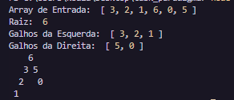
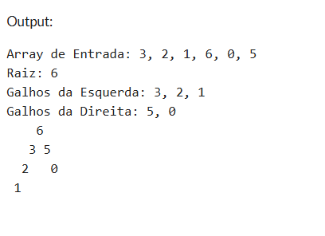
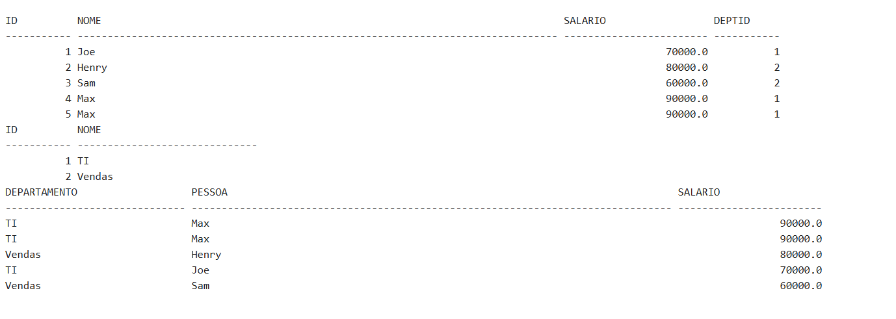

# Primeiro Caso

## Visualizador de Árvore (JavaScript & C#)

### Descrição
A função treeVisualizer cria uma representação visual de uma árvore binária no console, enquanto a função createTree processa um array para identificar a raiz e os galhos esquerdo/direito.

### Funcionalidades
- Identifica automaticamente o maior valor como raiz
- Separa os valores menores em galhos esquerdo e direito
- Ordena os galhos em ordem decrescente
- Gera uma visualização gráfica no console

### Exemplo de saída JS

### Exemplo de saída C#

*** 

# Segundo Caso

## Sistema de Banco de Dados (SQL)

### Descrição
O script SQL cria e popula duas tabelas relacionadas: PESSOA (funcionários) e DEPARTAMENTO, com uma consulta que retorna os salários ordenados do maior para o menor.

### Exemplo de saída

***

### Pré-requisitos
- .NET SDK para executar o c# ou acessar o <a href="https://onecompiler.com/csharp/" target="_blank">Compiler</a>
- Node.js para executar o JavaScript
- SQL Server ou compatível para executar o script SQL

### Como executar

### Para o C#
dotnet run (no diretorio do script) ou acesse o compiler e cole o <a href="./index.cs" target="_blank">código</a>

#### Para o JavaScript:
node index.js

#### Para o SQL:
Execute o script completo em seu gerenciador de banco de dados preferido.
